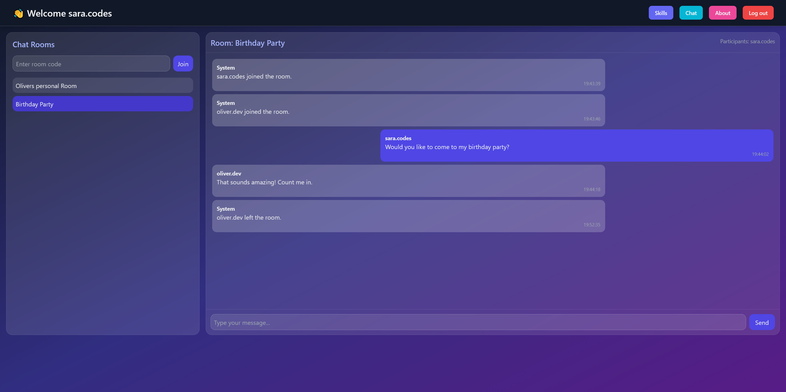
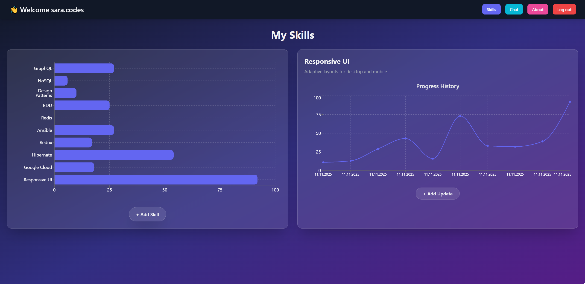
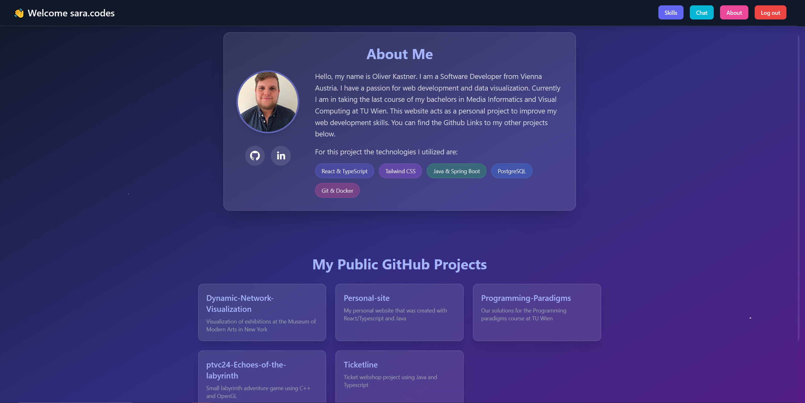

# 🌐 Oliver Kastner — Personal Portfolio

This is my personal portfolio website which will be built to showcase my projects, skills and background.

## 📸 Screenshots

| Section | Screenshot |
|----------|-------------|
| 💬 **Chatroom Example** |  |
| 💡 **Skill Tracker** |  |
| 👤 **About Section** |  |


---

## 🧩 Features

Here are some of the main features included (or planned):

| Category | Description |
|-----------|--------------|
| 💼 **Portfolio Showcase** | Highlight selected personal and professional projects with details and links. |
| 👤 **About Section** | Present personal background, education, and experience. |
| 💡 **Skill Tracker** | Create and track your personal goals and progress in them. |
| ⚡ **Real-time Chat (WIP)** | Interactive group-chatroom powered by WebSockets. |
| 🧠 **Authentication** | Secure login system using JWT-based authentication. |
| 🗃️ **Database Integration** | PostgreSQL backend with persistent storage for messages, accounts, chatrooms and skills. |
| 🎨 **Modern UI** | Built with TailwindCSS for a sleek and responsive design. |

---


## 🐳 Run with Docker

You can run the entire stack (frontend, backend, and database) with a single command through docker.

### 🔹 Requirements
- [Docker Desktop](https://www.docker.com/products/docker-desktop/)
- [Git](https://git-scm.com/)

### 🔹 Steps

1. **Clone the repository**
   ```bash
   git clone https://github.com/Oli2406/Personal-site.git
   cd Personal-site
    ```

2. **Build and start all services (must be in the project root)**
   ```bash
   docker compose up --build
   ```

3. **Access the application**
   - 🌐 **Frontend (React App):** [http://localhost:5173](http://localhost:5173)  
   - ⚙️ **Backend (Spring Boot API):** [http://localhost:8080](http://localhost:8080)  
   - 🐘 **PostgreSQL Database:** exposed on port `5433`

4. **Stop all containers**
   ```bash
   docker compose down
   ```
   ---

## ☸️ Run with Docker Desktop & Kubernetes

If you have **Docker Desktop** with **Kubernetes enabled**, you can deploy the entire stack and automatically rebuild it with a single click.

### 🔹 Requirements
- [Docker Desktop](https://www.docker.com/products/docker-desktop/) with Kubernetes enabled  
- [Git](https://git-scm.com/) (for Git Bash)

### 🔹 Quick Start

1. **Double-click** the file:
   ```bash
   redeploy.bat
   ```

   This script will:
   - Rebuild all Docker images (`frontend`, `backend`, `postgres`)
   - Recreate running containers
   - Restart Kubernetes deployments
   - Wait until the rollout completes successfully

2. Wait for the terminal to display:
   ```
   ✅ Redeployment complete!
   ```

3. Open your browser:
   ```
   http://frontend.localhost
   ```

NOTE: This is still a work in progress and not all features work while deployed.

---

## ⚙️ Technologies Used

| Layer | Stack |
|-------|--------|
| **Frontend** | React • TypeScript • Vite • TailwindCSS|
| **Backend** | Spring Boot • Java 21 • JPA |
| **Database** | PostgreSQL 16 |
| **DevOps** | Docker • Git |
---

This project is currently under active development
